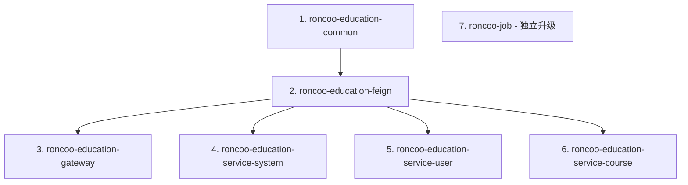

# Spring Boot 3.x 升级分析报告

## 当前版本状态

### 核心框架版本
- **Spring Boot**: 2.6.3 → 目标：3.2.x
- **Spring Cloud**: 2021.0.1 → 目标：2023.0.x  
- **Spring Cloud Alibaba**: 2021.0.1.0 → 目标：2023.0.x
- **Java**: 1.8 → 目标：17+

### 项目结构分析
```
roncoo-education/
├── roncoo-education-common/     # 公共模块 - 优先升级
│   ├── roncoo-education-common-core/      # 核心工具
│   ├── roncoo-education-common-log/       # 日志组件
│   ├── roncoo-education-common-service/   # 服务基础
│   └── roncoo-education-common-video/     # 视频处理
├── roncoo-education-feign/      # Feign接口模块
├── roncoo-education-gateway/    # 网关服务
├── roncoo-education-service/    # 业务服务
│   ├── roncoo-education-service-system/   # 系统服务
│   ├── roncoo-education-service-user/     # 用户服务
│   └── roncoo-education-service-course/   # 课程服务
├── roncoo-job/                 # 定时任务系统
└── roncoo-generator/           # 代码生成器
```

## 关键变更点分析

### 1. Jakarta EE 命名空间迁移 (高风险)

检测到的javax包使用：
- `javax.servlet.http.*` - 25处使用，主要在：
  - WebConfig.java
  - BaseBiz.java、BaseController.java
  - XXL-Job控制器和拦截器
- `javax.validation.constraints.NotNull` - 大量使用

**迁移策略**：
```java
// 需要替换的包
javax.servlet.* → jakarta.servlet.*
javax.validation.* → jakarta.validation.*
```

### 2. 核心依赖版本映射

| 当前组件 | 当前版本 | 目标版本 | 兼容性风险 |
|----------|----------|----------|------------|
| Spring Boot | 2.6.3 | 3.2.x | 高 |
| MyBatis | 需要检查 | 3.0.2+ | 中 |
| Knife4j | 3.0.3 | 4.3.0+ | 中 |
| XXL-Job | 内置版本 | 2.4.0+ | 中 |
| Hutool | 5.8.18 | 保持/升级 | 低 |
| JWT | 4.3.0 | 保持 | 低 |

### 3. 模块升级顺序 (基于依赖关系)



## 风险评估

### 高风险项
1. **Java 版本兼容性** - 从Java 1.8到17的跨越
2. **Jakarta EE迁移** - 大量的包名替换
3. **Spring Security配置** - 配置方式重大变更

### 中风险项
1. **第三方库兼容性** - Knife4j、MyBatis等
2. **配置属性变更** - 部分配置项重命名/废弃
3. **XXL-Job适配** - 定时任务系统升级

### 低风险项
1. **业务逻辑** - 核心业务代码影响较小
2. **数据库操作** - MyBatis映射基本兼容

## 升级策略建议

### 阶段1：基础环境准备
1. 更新Java版本配置到17
2. 添加Spring Boot Properties Migrator
3. 创建版本兼容性验证

### 阶段2：渐进式升级
1. 先升级到Spring Boot 2.7.x中间版本
2. 解决所有弃用警告
3. 验证功能完整性

### 阶段3：核心迁移
1. Jakarta EE包名自动化替换
2. 升级到Spring Boot 3.x
3. 更新Spring Cloud版本

### 阶段4：模块适配
1. 按依赖顺序逐个升级模块
2. 验证模块间接口兼容性
3. 更新配置和注解

## 关键配置变更预测

### Maven配置
```xml
<!-- Java版本 -->
<java.version>17</java.version>

<!-- Spring Boot版本 -->
<spring-boot.version>3.2.x</spring-boot.version>

<!-- Spring Cloud版本 -->
<spring-cloud.version>2023.0.x</spring-cloud.version>
```

### 应用配置变更
```yaml
# 配置属性名称变更示例
server:
  max-http-request-header-size: 8KB  # 原 max-http-header-size

spring:
  jpa:
    hibernate:
      naming:
        physical-strategy: org.hibernate.boot.model.naming.PhysicalNamingStrategyStandardImpl
```

## 测试验证计划

### 1. 编译验证
- 各模块编译成功率：100%
- 依赖解析无冲突

### 2. 功能验证
- 服务启动正常
- 接口调用正常
- 数据访问正常

### 3. 性能基准
- 启动时间对比
- 内存使用对比
- 响应时间对比

## 回滚方案

### 回滚触发条件
1. 编译失败且无法快速修复
2. 核心功能异常
3. 性能严重退化（>20%）

### 回滚步骤
1. 恢复Git版本到升级前状态
2. 重新部署验证环境
3. 分析问题并制定修复计划

---

*报告生成时间：2025-09-24*
*项目版本：14.0.0-RELEASE*